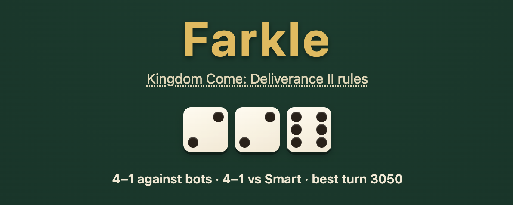
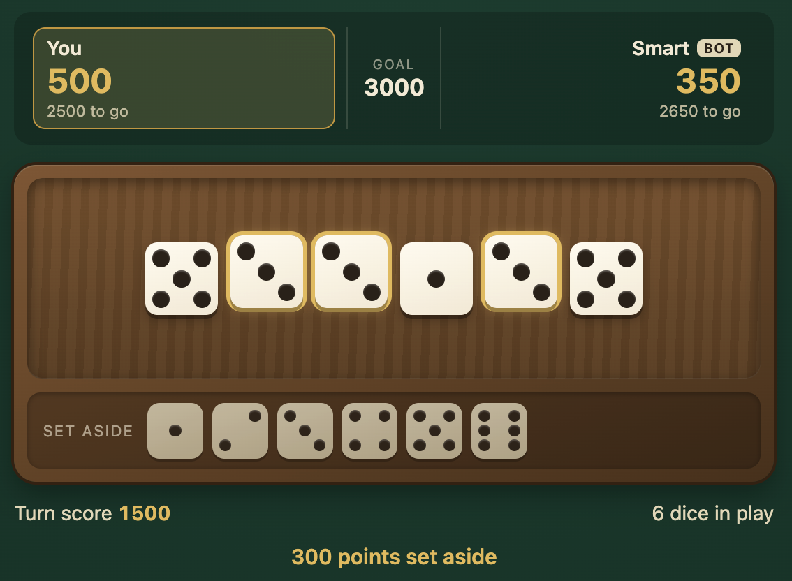
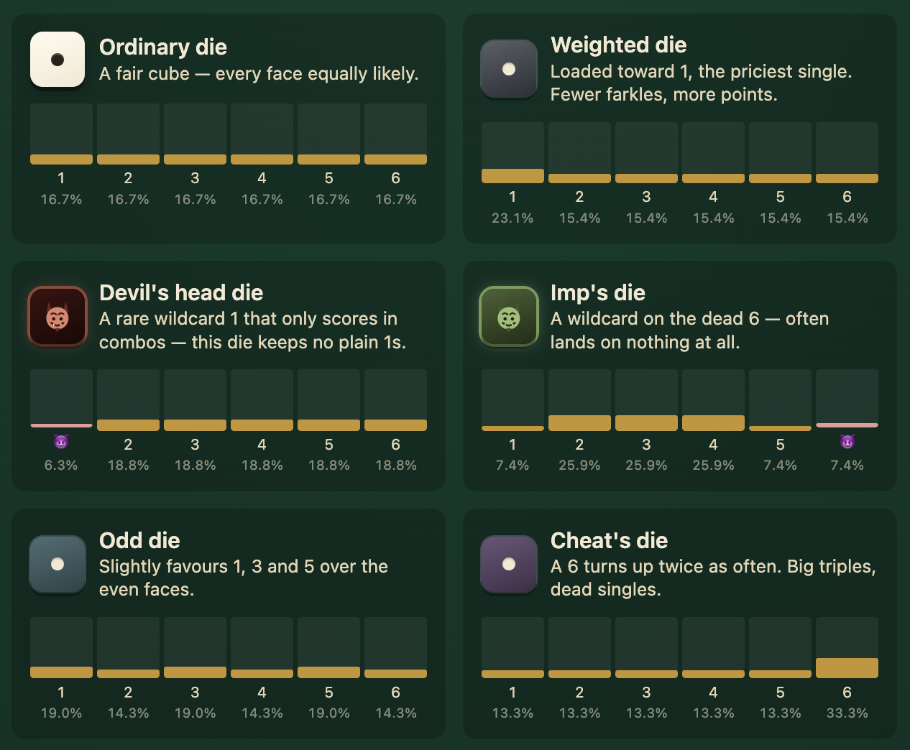

# farkle

A Farkle dice game using the rule set from *Kingdom Come: Deliverance II* —
weighted dice, configurable AI opponents, no badges.

**Play it now on [farkle.iamxox.space](https://farkle.iamxox.space)**



---

**Table** — roll, set aside scoring dice, and watch the goal countdown for both players.



---

**Dice gallery** — every KCD2 die (ordinary, weighted, Devil's head, Imp's, Odd, Cheat's) with its real face odds.



---

### Documentation

- [docs/RULES.md](docs/RULES.md) — the rules, specified precisely enough to test against
- [docs/DESIGN.md](docs/DESIGN.md) — architecture and technology decisions
- [docs/PLAN.md](docs/PLAN.md) — milestones
- [docs/DEVELOPMENT.md](docs/DEVELOPMENT.md) — repo map, how to run things, current status

### Development

```bash
npm install
npm test          # vitest, including the exhaustive scoring suite
npm run typecheck
npm run build
npm run play       # build and launch the terminal game
npm run dev:web    # launch the browser game
```

See [docs/DEVELOPMENT.md](docs/DEVELOPMENT.md) for the full layout and how
things fit together.
